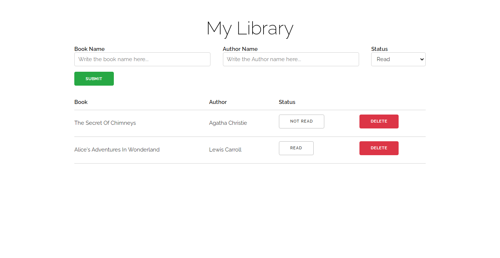

# MyLibrary

> Library with 2 books added
---
## Live Demo
[Live Demo Here](https://amen6.github.io/MyLibrary/)

## Description

MyLibrary is a book collection manager, where you can **add**, **remove**, and **update** books, where you can specify book and author name, and if you have read it or not. I've also used **local storage** so the information will be saved.

## How To Use

- ### Adding A Book
    Adding a book is very simple, you just need to write book/author name, read status and click `Submit`.

- ### Deleting A Book
    To delete a specific book, just click the `Delete` button in the same row as the book. A confirmation message will appear to prevent deleting a book accidentally.

- ### Editing Read Status    
    It works in the same way as the `Delete` button works, it determines if you have read the book or not. 

---